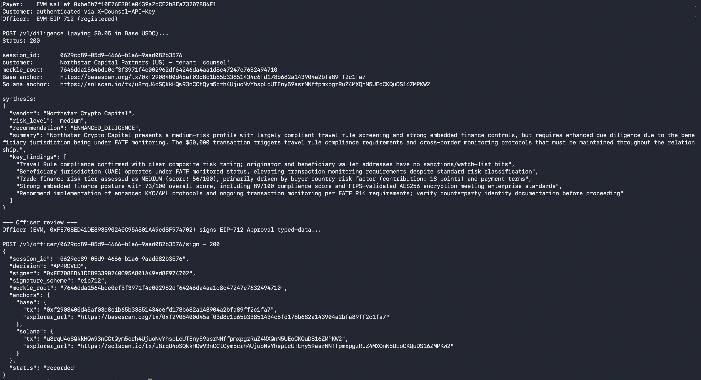
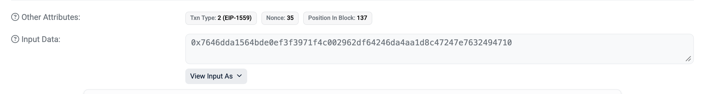
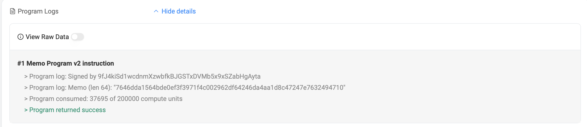

# Counsel — Decision Integrity Layer for Institutional AI Agents

**EasyA Consensus 2026 · Miami · Multi-chain on Base + Solana**

> Pay $0.05 in Base or Solana USDC via x402. Get an AI-synthesized vendor compliance recommendation grounded in three independent providers. Every decision lives forever as a Merkle root anchored on **both** Base and Solana mainnet, signed by an authorized human officer (Metamask or Phantom), evidence locked WORM in S3 for 7 years. Forging the chain requires breaking SHA-256 *and* the officer's private key *and* reorging two L1s.

Counsel is the compliance + integrity vertical of the agentic API economy. Where [pay.sh](https://github.com/solana-foundation/pay) (Solana Foundation + Google Cloud, launched today) is horizontal infrastructure for any AI agent paying for any API, Counsel is the regulated-decisioning vertical built on the same x402 substrate.

---

## Demo

Counsel is API-first; the operator surface is the terminal + block explorers shown below.

📹 **Loom walkthrough:** [Counsel — Decision Integrity Layer for Institutional AI Agents](https://www.loom.com/share/e14f5fdc79bf4e36a706fbbe68ab9958) — 4-minute demo + repo tour, with three live mainnet calls (200 / 401 / 403) and on-chain verification.

### Live evidence — same Merkle root, two independent L1s

`7646dda1564bde0ef3f3971f4c002962df64246da4aa1d8c47247e7632494710`

This 64-character hash is anchored on **both** Base and Solana mainnet from a single diligence call. The same hash appears in three places: Counsel's terminal output, the Base transaction's calldata, and the Solana Memo program's data field.

**1. Diligence runs end-to-end** — paying $0.05 USDC, three providers in parallel, Bedrock synthesis, dual-chain anchor, EIP-712 officer signature, decision recorded.



**2. Base anchor — Merkle root as EIP-1559 calldata.**
[basescan.org/tx/0xf2908400…](https://basescan.org/tx/0xf2908400d45af03d8c1b65b33851434c6fd178b682a143904a2bfa89ff2c1fa7) — the Input Data field IS the anchor; calldata is permanent on-chain.



**3. Solana anchor — Merkle root via Memo program.**
[solscan.io/tx/u8rqU4oS…](https://solscan.io/tx/u8rqU4oSQkkHQw93nCCtQym5crh4UjuoNvYhspLcUTEny59asrNNffpmxpgzRuZ4MXQnN5UEoCKQuDS16ZMPKW2) — Memo content shows the same 64-char hash, signed by the Solana treasury wallet.



> Forging this approval requires breaking SHA-256, the officer's secp256k1 private key, AND reorging two independent L1s simultaneously.

---

## The Problem

AI agents are moving into institutional workflows: trade approvals, vendor onboarding, compliance screening. But there's no standard way to:

1. **Pay for compliance data** at query time (current: annual licenses, manual integrations)
2. **Prove** the AI saw what it claims to have seen before recommending APPROVE
3. **Give a compliance officer** a reviewable, signable record anchored to a block

Counsel solves all three.

---

## How It Works

```
Client Agent ──$0.05 USDC x402 (Base OR Solana)──►  Counsel API (AWS Lambda)
                                                          │
                                          ┌───────────────┼───────────────┐
                                          ▼               ▼               ▼
                                    MRU SENTINEL    Orbis Trade     Orbis Embedded
                                    Travel Rule     Finance Risk    Finance Score
                                   (x402 $0.005)  (x402 $0.005)   (x402 $0.005)
                                          │               │               │
                                          └───────────────┴───────────────┘
                                                          │
                                              Bedrock Claude synthesis
                                                          │
                                       Merkle root over evidence + synthesis
                                                          │
                                  ┌───────────────────────┴───────────────────────┐
                                  ▼                                               ▼
                           Base mainnet                                    Solana mainnet
                          (calldata tx)                                   (Memo program)
                                  │                                               │
                                  └───────────────────────┬───────────────────────┘
                                                          │
                              Officer signs Merkle root: Metamask (EIP-191) OR Phantom (Ed25519)
                                                          │
                                       Server detects scheme, verifies, returns signer
```

1. **Client pays $0.05 USDC** via x402 — Base or Solana, their choice. CDP facilitator settles on whichever chain the client signed for.
2. **Counsel pays compliance APIs** in parallel via x402 (live: MRU Travel Rule on Base; Solana providers registered, integration pending)
3. **Claude Haiku synthesizes** the evidence into a structured recommendation
4. **Merkle root** is computed over all evidence + synthesis hashes
5. **The same Merkle root is anchored to Base AND Solana in parallel** — EIP-1559 calldata on Base, Memo program on Solana. Two independent L1s every call.
6. **Compliance officer signs the Merkle root** with whatever wallet they have. Server inspects the request: with `signer_pubkey` it verifies an Ed25519 signature against the Solana pubkey; without, it ECDSA-recovers the EVM address from the EIP-191 personal_sign.

Forging an approval requires breaking SHA256 *and* the officer's private key (secp256k1 or Ed25519). Reverting the audit trail requires reorging two independent L1s.

---

## Live Demo

**API:** `https://ki55wa4a21.execute-api.us-east-1.amazonaws.com`

### Prerequisites — first time only

The institution and its compliance officers must be enrolled before they can use the API. This is one-time setup per tenant.

```bash
# 1. Register a customer (returns an API key — shown ONCE)
curl -X POST $API/v1/admin/customers \
  -H "Authorization: Bearer $ADMIN_API_KEY" \
  -d '{"customer_name":"Acme Capital","customer_country":"US","tenant":"acme"}'
# → ck_live_<random32>

# 2. Enroll an EVM compliance officer
curl -X POST $API/v1/admin/officers \
  -H "Authorization: Bearer $ADMIN_API_KEY" \
  -d '{"signer":"0xFE70...","scheme":"eip712","tenant":"acme","label":"Jane Doe (CCO)"}'

# 3. Enroll a Solana compliance officer (optional)
curl -X POST $API/v1/admin/officers \
  -H "Authorization: Bearer $ADMIN_API_KEY" \
  -d '{"signer":"A9LWeC...","scheme":"ed25519","tenant":"acme","label":"John Smith (Compliance)"}'
```

### Run a diligence call

```bash
pip install requests 'x402[evm,svm]' eth-account solders base58

export CLIENT_PRIVATE_KEY=0x...        # EVM payer (for Base USDC)
export SOLANA_CLIENT_KEY=...           # base58 Solana keypair (for Solana USDC, optional)
export OFFICER_PRIVATE_KEY=0x...       # EVM officer (matches step 2 above)
export OFFICER_SOLANA_KEY=...          # Solana officer (matches step 3, optional)
export COUNSEL_API_KEY=ck_live_...     # from step 1 above

# Default: pay in Base USDC, EVM officer signs EIP-712
python test_e2e.py

# Solana USDC payment + Phantom-style officer signs Ed25519
python test_e2e.py --solana-pay --solana-sign

# Demo enforcement failures live
python test_e2e.py --rogue-customer    # 401 (no API key)   — before any x402 charge
python test_e2e.py --rogue-officer     # 403 (not allowlisted) — after diligence runs
```

### Sample response

```json
{
  "session_id": "6707f47b-ce61-4faf-9fa7-aef629adbff5",
  "tenant": "acme",
  "customer": {
    "name": "Acme Capital",
    "country": "US",
    "key_hash": "04560d4b89..."
  },
  "vendor": "Northstar Crypto Capital",
  "merkle_root": "ab0898397c86fbf97c99c6f8b29e55ab697315705777ee1d106e2dcb9bd686b3",
  "anchors": {
    "base": {
      "tx": "0x7fb4d107...",
      "explorer_url": "https://basescan.org/tx/0x7fb4d107..."
    },
    "solana": {
      "tx": "sXsqoM2nu...",
      "explorer_url": "https://solscan.io/tx/sXsqoM2nu..."
    }
  },
  "evidence": { "travel_rule": {...}, "trade_finance_risk": {...}, "embedded_finance_score": {...} },
  "synthesis": {
    "risk_level": "low",
    "recommendation": "APPROVE",
    "summary": "...",
    "key_findings": [...]
  },
  "officer_url": "/v1/officer/6707f47b-ce61-4faf-9fa7-aef629adbff5"
}
```

After the officer signs:

```json
{
  "session_id": "6707f47b-...",
  "decision": "APPROVED",
  "signer": "0xFE708ED41DE893390240C95A801A49ed8F974702",
  "signature_scheme": "eip712",
  "merkle_root": "ab0898397c...",
  "anchors": {"base": {...}, "solana": {...}},
  "status": "recorded"
}
```

---

## API

### `POST /v1/diligence` — x402-gated ($0.05 USDC, Base **or** Solana)

Headers: `X-Counsel-API-Key: ck_live_...` (required), `Idempotency-Key: <uuid>` (optional, 24h cache).

```json
{
  "vendor_name": "Northstar Crypto Capital",
  "vendor_country": "AE",
  "vendor_wallet": "0x...",
  "amount_usd": 50000
}
```

Returns: `session_id`, `tenant`, `customer`, `evidence`, `synthesis`, `merkle_root`, `anchors.base`, `anchors.solana`, `officer_url`. Replays of a prior `Idempotency-Key` return the cached response with `Idempotent-Replayed: true` header — no x402 charge.

Auth failure modes (in order of evaluation): `401` if `X-Counsel-API-Key` is missing or invalid, `409` if `Idempotency-Key` is reused with a different payload, `402` if x402 payment fails.

### `GET /v1/officer/{session_id}`

Returns the officer review payload: session metadata, `merkle_root`, both `anchors`, `sign_url`, and a `signing_payload_hint` describing both EIP-712 and Solana payload formats.

### `POST /v1/officer/{session_id}/sign`

Two signing schemes; server detects from request shape.

**EVM (Metamask) — EIP-712 typed data:**

The officer signs an EIP-712 typed-data structure with `domain={name:"Counsel", version:"1", chainId:8453}` and `Approval={session_id, merkle_root, decision}`. Metamask renders this as a structured prompt instead of an opaque hash.

```json
{
  "decision": "APPROVED",
  "signature": "0x<EIP-712 ECDSA signature>",
  "notes": "Travel rule clear; approved per FATF R.16."
}
```
Server ECDSA-recovers the signer address from the typed-data hash.

**Solana (Phantom) — Ed25519 over domain-prefixed bytes:**

The officer signs UTF-8 bytes of:
```
Counsel/v1
chain=solana
session_id=<uuid>
merkle_root=<hex>
decision=APPROVED
```

```json
{
  "decision": "APPROVED",
  "signature": "<base58 Ed25519 signature>",
  "signer_pubkey": "<base58 Solana pubkey>",
  "notes": "Travel rule clear."
}
```
Server verifies the signature against the supplied pubkey.

Both schemes bind the signature to `session_id` + `merkle_root` + `decision` — kills cross-session replay, cross-app phishing, and decision-flip attacks.

Returns: `decision`, `signer`, `signature_scheme` (`"eip712"` or `"ed25519"`), `merkle_root`, both `anchors`, `status`. `403` if the recovered signer is not in the tenant's officer allowlist.

### Admin endpoints (admin bearer auth)

All `/v1/admin/*` routes require `Authorization: Bearer <ADMIN_API_KEY>`. Constant-time comparison; missing token returns 503 (fail-closed).

| Method | Path | Purpose |
|--------|------|---------|
| `POST` | `/v1/admin/customers` | Register a customer; returns API key once |
| `GET` | `/v1/admin/customers` | List customers (no keys) |
| `DELETE` | `/v1/admin/customers/{key_hash}` | Revoke a customer |
| `POST` | `/v1/admin/officers` | Enroll an officer in a tenant's allowlist |
| `GET` | `/v1/admin/officers?tenant=...` | List officers for a tenant |
| `DELETE` | `/v1/admin/officers/{signer}` | Revoke an officer |
| `POST` | `/v1/admin/erasure` | GDPR Art. 17 — anonymize PII for a session/vendor while preserving audit chain |

---

## The Integrity Chain

```
evidence_hash_1 ─┐
evidence_hash_2 ─┼─► merkle_root ──┬─► Base tx (calldata)        ──┐
synthesis_hash  ─┘                 └─► Solana tx (Memo program)   ─┤
                                                                    └─► officer.sign(merkle_root)
                                                                                │
                                                                          signer_address
                                                                    (cryptographically bound)
```

Every Counsel decision carries:
- A **content hash** of every data source the AI touched
- **Two on-chain timestamps** (Base + Solana) proving when it happened
- A **wallet signature** from the human officer tied to that exact evidence set

---

## Multi-Chain via `gavel_toolkit`

`gavel_toolkit` is the provider-agnostic discovery layer — a JSON registry mapping compliance intents to x402 endpoints across multiple chains. Forkable, no Python changes needed to add a provider.

```python
from gavel_toolkit.discovery import resolve, list_intents

list_intents()
# ['embedded_finance_compliance', 'kyc_attestation', 'trade_finance_risk',
#  'travel_rule_compliance', 'wallet_screening']

# resolve() is chain-agnostic — same call returns providers across networks
resolve("wallet_screening")
# [{"id": "solana_aml_checker",   "network": "solana:5eykt4Us...", "price_usd": 0.001},
#  {"id": "scorechain_solana_aml","network": "solana:5eykt4Us...", "price_usd": 0.01}]
```

**Built-in providers:**

| Provider | Intent | Network | Price |
|----------|--------|---------|-------|
| MRU SENTINEL Travel Rule | `travel_rule_compliance` | `eip155:8453` | $0.005 |
| Orbis Trade Finance Risk | `trade_finance_risk` | `eip155:8453` | $0.005 |
| Orbis Embedded Finance Score | `embedded_finance_compliance` | `eip155:8453` | $0.005 |
| Scorechain Solana AML | `wallet_screening` | `solana:5eykt4Us...` | $0.01 |
| Solana Attestation Service | `kyc_attestation` | `solana:5eykt4Us...` | $0.005 |
| SOLANA AML Checker | `wallet_screening` | `solana:5eykt4Us...` | $0.001 |

See [gavel_toolkit/README.md](gavel_toolkit/README.md) for the full registry schema.

---

## Tech Stack

| Layer | Tech |
|-------|------|
| Payment rail (inbound) | [x402](https://github.com/coinbase/x402) `[evm,svm,fastapi]` — accepts Base USDC **or** Solana USDC |
| Facilitator | Coinbase Developer Platform (EdDSA JWT auth, settles on both chains) |
| Base anchor | Base mainnet — Merkle root as EIP-1559 calldata (`web3.py`) |
| Solana anchor | Solana mainnet — Memo program (`solders` + raw RPC) |
| Officer signing | EIP-712 typed data (secp256k1, `eth-account`) **or** Ed25519 over domain-prefixed bytes (`solders.signature`) — auto-detected |
| Officer authorization | Allowlist registry in DynamoDB; admin-gated `/v1/admin/officers` enrollment with HMAC bearer auth |
| Idempotency | `Idempotency-Key` header → 24h-TTL request cache; replays return `Idempotent-Replayed: true` without re-charging x402 |
| Evidence vault | S3 with Object Lock COMPLIANCE mode, 7-year retention; DynamoDB stores hash + S3 URI only |
| API | FastAPI + AWS Lambda (Mangum) |
| AI | Amazon Bedrock — Claude Haiku 4.5 |
| Compliance data | MRU SENTINEL, Orbis (live on Base); Scorechain / SAS / SOLANA-AML-Checker (registered, pending) |
| Discovery | `gavel_toolkit` — chain-agnostic JSON registry, CAIP-2 networks |

---

## Security Posture

Counsel was built with institutional review in mind. The following are **shipped today**:

- **Domain-separated officer signatures.** EVM officers sign EIP-712 typed data with `domain={Counsel, v1, chainId 8453}` and `Approval={session_id, merkle_root, decision}`. Solana officers sign Ed25519 over `Counsel/v1\nchain=solana\nsession_id=...\nmerkle_root=...\ndecision=...`. Kills cross-session replay, cross-app phishing, and decision-flip attacks.
- **Officer allowlist registry.** A valid signature is necessary but not sufficient — recovered signers must be enrolled in the per-tenant allowlist. Unauthorized signers receive 403 even with mathematically valid signatures.
- **Admin-gated registry mutations.** `/v1/admin/officers` POST/DELETE/GET require a bearer token verified with `hmac.compare_digest`. Fail-closed: missing `ADMIN_API_KEY` returns 503.
- **WORM evidence vault.** Raw provider responses + Bedrock outputs are written to S3 with Object Lock COMPLIANCE mode and 7-year retention. DynamoDB stores only the SHA-256 hash + `s3://` URI + version-id + ETag. An operator with table-write perms cannot rewrite the underlying evidence — the locked S3 object is immutable for the retention window even to root.
- **Atomic officer claim.** `record_approval` uses DynamoDB `ConditionExpression` "status = pending" so two concurrent signers cannot both succeed; the loser receives a clean 409.
- **Idempotency.** `Idempotency-Key` header + payload-hash binding. Replays return cached responses without re-charging x402 or re-running outbound compliance calls. Different payload + same key returns 409.
- **Dependency lockfile.** `src/requirements.txt` is autogenerated from `requirements.in` via `uv pip compile`; every transitive package is pinned. Supply-chain drift is caught at compile time.
- **Scoped Bedrock IAM.** Lambda execution role can invoke only the Claude Haiku family of foundation models + cross-region inference profiles in this account, not the entire Bedrock service.
- **AWS Secrets Manager for runtime secrets.** Treasury wallet keys (EVM + Solana), CDP API key secret, and the admin bearer token live in a single composite secret (`counsel/runtime`). Lambda env vars carry only the secret ARN; values are fetched at cold-start via `services/secrets.py` and cached in process memory. Lambda IAM is scoped to `secretsmanager:GetSecretValue` on that specific ARN; CloudTrail logs every access. Secrets can be rotated via `aws secretsmanager update-secret` without a stack redeploy.
- **API Gateway edge throttling.** 100 RPS sustained / 50 in-flight burst per stage, applied via `apigatewayv2 update-stage` (see `scripts/apply_throttling.sh`). Defends against the asymmetric spend-amplification vector — an attacker paying $0.05 inbound to trigger $0.015 outbound + Bedrock cost gets rate-limited at the AWS edge before any of that fires.
- **Customer authentication on `/v1/diligence`.** Per-institution API keys (`ck_live_...`) registered via `/v1/admin/customers`; raw keys returned exactly once and stored only as SHA-256 hashes in DynamoDB. Middleware runs BEFORE x402 — a missing or revoked key returns 401 without ever charging the customer. The authenticated customer's identity (name, country, tenant) flows into the travel-rule originator field and into the per-tenant officer registry scope, so an officer registered for tenant *A* cannot approve a tenant *B* session.
- **GDPR Article 17 (Right-to-Erasure) endpoint.** `POST /v1/admin/erasure` (admin-gated) accepts a `session_id` or `vendor_name`, locates matching sessions, and anonymizes PII fields (`vendor_name`, `customer`, `notes`) with `[ERASED]` markers + `erased_at` timestamps. Hash-bound audit fields (Merkle root, signer, anchor txs, vault refs, decision) are preserved per AML retention rules. Every erasure writes an audit log row keyed by erasure_id with the requesting party + reason.
- **DynamoDB TTL on session + erasure rows.** All session and erasure rows carry a `ttl_at` attribute set to `started_at + 7y` (matching FATF R.11 / FinCEN BSA / EU AMLD record-keeping windows). DynamoDB auto-purges expired rows; configured via `scripts/apply_ttl.sh` since `AWS::Serverless::SimpleTable` doesn't expose `TimeToLiveSpecification` directly.

The following are **planned / production-track**:

| Item | Status | Approach |
|------|--------|----------|
| Customer-managed KMS key (CMK) for the secret + S3 vault | Roadmap | Replace AWS-managed encryption with a customer-controlled CMK; key policy separates Lambda read role from operator-write role. |
| Multi-sig treasury (Safe on Base, Squads on Solana) | Roadmap | Treasury becomes a 2-of-3 multi-sig with daily spend caps and 24h timelock for treasury changes. Anchor txs become signed proposals. |
| AWS WAF v2 with IP reputation + managed rule set | Roadmap | WAF v2 doesn't natively attach to API Gateway HTTP API (v2). Production posture: CloudFront in front of HTTP API → attach WAF web ACL with rate-based rule, IP reputation list, and tuned CommonRuleSet. Native API Gateway throttling provides L7 rate-limit coverage in the meantime. |
| Lambda in VPC with PrivateLink endpoints | Roadmap | Bedrock + DynamoDB + S3 via VPC endpoints; outbound HTTPS via NAT-pinned IPs for IP allowlisting on partner APIs. |
| Anomaly detection | Roadmap | CloudWatch alarms on REJECT spike, unusual jurisdictions, officer signing volume; SIEM integration. |

The architecture (stateless Lambda, hash-only DynamoDB, WORM S3, allowlisted officers, multi-chain anchoring) is designed so that each roadmap item drops in without rewriting core logic.

---

## Data Flow + Processor Relationships

Counsel acts as the **controller** for diligence sessions and engages the following **processors**:

| Processor | Data shared | Purpose |
|-----------|-------------|---------|
| Coinbase Developer Platform (x402 facilitator) | Wallet addresses, payment amounts, signatures | Verify + settle x402 payments on Base / Solana |
| Amazon Bedrock (Claude Haiku 4.5) | Synthesized evidence summary (vendor jurisdiction, scores) | LLM synthesis of the compliance recommendation |
| MRU SENTINEL | Originator + beneficiary identity, jurisdiction, amount | FATF Travel Rule R.16 compliance check |
| Orbis (or self-hosted stub) | Transaction value, jurisdiction, payment terms | Trade-finance + embedded-finance risk scoring |
| Solana mainnet RPC | Memo program tx with Merkle root only | On-chain anchor (no PII transmitted) |
| Base mainnet RPC | EIP-1559 calldata tx with Merkle root only | On-chain anchor (no PII transmitted) |

Customers (tenants) act as controllers for their own vendor data; Counsel acts as a sub-processor when forwarding that data to the downstream compliance providers above.

## Data Subject Rights (GDPR Articles 15–22)

| Right | Status | Mechanism |
|-------|--------|-----------|
| Right of access (Art. 15) | ✅ | `GET /v1/officer/{session_id}` returns session metadata; admin can list per-tenant sessions |
| Right to rectification (Art. 16) | ⚠️ | Sessions are immutable by design; rectification = new session referencing the prior |
| Right to erasure (Art. 17) | ✅ | `POST /v1/admin/erasure` anonymizes PII fields (`vendor_name`, `customer`, `notes`) immediately; preserves hash + signer + anchor txs for the AML retention window |
| Right to restriction (Art. 18) | Roadmap | Implementable via session status flag; not exposed yet |
| Right to portability (Art. 20) | ✅ | Evidence + synthesis JSON downloadable from S3 vault for the session owner |
| Right to object (Art. 21) | ✅ | Customer can revoke their API key via `DELETE /v1/admin/customers/{key_hash}`, blocking future processing |

**Erasure / retention reconciliation.** Right-to-Erasure conflicts with AML record-keeping (FATF Recommendation 11, FinCEN BSA, EU AMLD all require ~5–7 years of retention). Counsel's approach: anonymize identifying fields immediately on Article 17 request, preserve the hash-bound integrity record (Merkle root, anchor txs, signer, decision) for the AML retention window, and physically delete after retention via DynamoDB TTL (`ttl_at` attribute, 7-year default) and S3 Object Lock retention expiry. Crypto-erasure of S3 evidence pre-retention is a roadmap option via per-tenant KMS CMK whose deletion renders the encrypted blobs unreadable.

---

## Position in the Ecosystem

On **2026-05-05** the Solana Foundation and Google Cloud launched [**pay.sh**](https://github.com/solana-foundation/pay) — an x402-native API marketplace with 50+ providers (Helius, Alchemy, Dune, Nansen, plus Google Cloud's BigQuery / Gemini / Cloud Run) and a built-in MCP server for Claude Code, Codex, Cursor, and other agent runtimes.

Counsel and pay.sh are complementary, not competitive:

| | pay.sh | Counsel |
|---|---|---|
| **Layer** | Horizontal infrastructure | Vertical compliance + integrity |
| **Audience** | Any AI agent paying for any API | Institutional agents making regulated decisions |
| **Settlement** | x402 on Solana | x402 on Base **and** Solana |
| **Output** | Proxied API responses | Hash-bound evidence chain anchored on two L1s, signed by an authorized human officer |
| **Hosted on** | Google Cloud Platform | AWS (Lambda + Secrets Manager + S3 Object Lock) |

`gavel_toolkit` provider entries can declare `"via": "pay.sh"` to indicate dispatch through the pay.sh proxy. One placeholder is registered today (`helius_rpc_via_paysh`); native pay.sh dispatch is the next integration step in the roadmap. The point: Counsel is a compliance-vertical built on the same x402 substrate the Solana Foundation just blessed as the standard for the agentic API economy.

---

## Why x402 + Base + Solana

x402 turns compliance APIs into pay-per-query infrastructure. Sub-cent micropayments make it economical to call multiple providers per decision — impossible with traditional rails (Stripe, ACH, wire). The Coinbase facilitator settles on-chain with no accounts, no invoices, no shared API keys.

Base mainnet provides cheap calldata (~$0.0006 per anchor) for production-volume per-decision anchoring. Solana adds a second independent L1 with sub-second finality and ~$0.0008 Memo costs, doubling the integrity guarantee. CAIP-2 chain identifiers throughout the registry make multi-chain composability native, not bolted-on.

Counsel is genuinely chain-neutral at every layer that matters for institutional integrity: the client picks the payment chain, the officer picks the signature scheme, and the evidence chain anchors to both. The compliance providers themselves are registered cross-chain so that as the Solana x402 ecosystem matures, no Counsel code change is needed to route real calls there.

---

## Repository Structure

```
gavel/
├── src/
│   ├── app.py                       # FastAPI + 3 middlewares + Mangum
│   ├── models.py                    # Pydantic request schemas
│   ├── requirements.in              # Direct dependencies
│   ├── requirements.txt             # uv-pip-compiled lockfile (301 packages pinned)
│   ├── routes/
│   │   ├── admin.py                 # /v1/admin/{customers,officers,erasure}
│   │   ├── diligence.py             # POST /v1/diligence
│   │   ├── officer.py               # GET/POST /v1/officer/{id}
│   │   └── stub.py                  # Self-hosted Orbis-shape stubs
│   └── services/
│       ├── bazaar_client.py         # Outbound x402 compliance calls
│       ├── bedrock_client.py        # Claude Haiku synthesis
│       ├── cdp_auth.py              # CDP EdDSA JWT facilitator auth
│       ├── customer_registry.py     # Per-tenant API keys (S5)
│       ├── erasure.py               # GDPR Art. 17 erasure handler
│       ├── evidence_store.py        # DynamoDB + Merkle root + dual anchor + S3 vault
│       ├── idempotency.py           # Idempotency-Key cache layer (S10)
│       ├── officer_registry.py      # Per-tenant officer allowlist (S1)
│       ├── secrets.py               # Secrets Manager fetch + cache (S2)
│       └── signing.py               # EIP-712 + Solana domain-prefix verifiers (S3)
├── gavel_toolkit/
│   ├── discovery.py                 # resolve() / resolve_and_call() — chain-agnostic
│   ├── providers/                   # JSON registry (7 providers, 2 chains, 1 via=pay.sh)
│   └── README.md
├── scripts/
│   ├── apply_throttling.sh          # Apply API Gateway rate limit + burst (S9)
│   ├── apply_ttl.sh                 # Enable DynamoDB TTL on session/erasure rows (S12)
│   ├── create_treasury_usdc_ata.py  # First-deploy: create Solana treasury USDC ATA
│   ├── test_idempotency.py          # Demonstrate Idempotent-Replayed behavior
│   └── test_solana_anchor.py        # Standalone Memo-program smoke test
├── template.yaml                    # AWS SAM (Lambda + DynamoDB + S3 Object Lock + Secrets Manager)
└── test_e2e.py                      # Full mainnet e2e — pays real USDC, signs EIP-712 / Ed25519
```

---

## Closing

Counsel ships **eleven shipped institutional security controls** verified live on AWS — domain-separated EIP-712 + Ed25519 signing, per-tenant officer allowlist, WORM evidence vault on S3 Object Lock, AWS Secrets Manager for runtime secrets, scoped Bedrock IAM, pinned dependency lockfile, API Gateway edge throttling, customer authentication with payload-hash idempotency, GDPR Article 17 erasure with AML retention reconciliation, atomic concurrent-officer claim, and 7-year DynamoDB TTL — alongside the multi-chain integrity story that defines the product.

Three independent compliance providers, AI synthesis grounded in real numbers, every Merkle root anchored on Base **and** Solana mainnet every call, and a human officer signature cryptographically bound to that exact evidence set. Forging a Counsel approval requires breaking SHA-256, the officer's private key, and reorging two L1s.

Built solo at **EasyA Consensus 2026 · Miami**. Repo: [`hypeprinter007-stack/gavel`](https://github.com/hypeprinter007-stack/gavel). Live: `https://ki55wa4a21.execute-api.us-east-1.amazonaws.com`.
